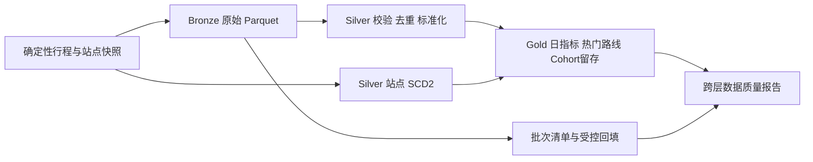

# 共享单车离线湖仓与增量分析

[](https://github.com/ZliY221/Offline-lake-warehouse-and-incremental-analysis-of-shared-bikes/actions/workflows/ci.yml)

这是面向数据开发、数仓开发和大数据开发实习岗位的第二个独立作品集项目。它使用 PySpark 本地模式和 Parquet 演练批处理数仓，重点展示显式数据契约、Bronze/Silver/Gold 分层、分区增量处理、维度历史、数据质量与 SQL，而不是重复旗舰项目中的 Kafka/Flink 实时链路。

本项目是根据学习目标重新实现的新项目，不是对旧课程源码的恢复，也不宣称生产集群经验。

## 当前进度

- [x] 在 Windows 11 + WSL、Python 3.14、JDK 17 环境真实启动 Spark 4.2.0 `local[2]`，完成 DataFrame 聚合与 Parquet 往返读写。
- [x] 定义脱敏共享单车行程与站点快照契约。
- [x] 实现固定随机种子的确定性测试数据生成器。
- [x] 使用显式 Spark Schema 读取 NDJSON，不依赖自动推断业务类型。
- [x] 将 Bronze 行程写为按 `ingestion_date` 分区的 Parquet。
- [x] 使用动态分区覆盖实现同批次安全重跑，并保留未触及日期分区。
- [x] 实现 Silver 合法性校验、最小披露拒绝数据、精确/冲突去重与派生字段。
- [x] 实现站点快照校验、冲突隔离与 SCD2 历史维度。
- [x] 实现 Gold 日指标、SCD2 时态关联和分区 Top 路线。
- [x] 为 Bronze 摄取加入确定性批次 ID、文件指纹和原子状态清单。
- [x] 实现单日期预检、跨分区主键保护、Silver/Gold 受影响分区重算，以及 cohort 旧/新归属日期依赖传播。
- [x] 实现跨层行数、SCD2 区间、Gold 汇总和路线排名质量报告。
- [x] 完成固定输入、预热加三轮测量的本机端到端性能证据。
- [x] 使用纯合成匿名骑行者键实现 cohort 留存分析。
- [x] 完成 Sort-Merge Join、显式 Broadcast Hash Join 与 AQE 的真实格式化物理计划证据。
- [x] 构造 90% 热点键倾斜场景，验证 AQE 最终计划的分区合并与倾斜 Join 拆分。
- [x] 通过 Spark UI `/api/v1` 保存 Job、Stage 和 Task 级 Shuffle、耗时、GC 与 Spill 指标。
- [x] 使用真实五阶段 Spark 链路验证依赖编排、失败重试、日志哈希与断点恢复。

## 为什么单独建仓

电商项目证明实时事件时间、状态、异常侧流和批流对账；本项目专注批处理与离线数仓：

| 项目 | 主要证据 |
| --- | --- |
| 电商实时数据仓库 | Kafka、Flink、ClickHouse、Watermark、状态去重、至少一次写入 |
| 共享单车离线湖仓 | Spark DataFrame/SQL、Parquet 分区、增量覆盖、SCD2、离线质量与回填 |

## 实现数据流



## 当前目录

```text
bike-trip-lakehouse/
├─ .github/workflows/        持续集成
├─ data/sample/              固定脱敏正常样例
├─ data/quality/             固定质量问题演示批次
├─ docs/                     需求、架构和学习材料
├─ evidence/                 经核验的原始性能证据
├─ scripts/                  环境探测、生成和测试脚本
├─ src/bike_lakehouse/       分层作业、控制流程、质量与基准代码
├─ tests/                    Python 与本地 Spark 测试
├─ pyproject.toml
└─ README.md
```

## 环境

- Python 3.10 或更高版本；
- JDK 17 或更高版本；
- PySpark 4.2.0。

安装依赖：

```powershell
python -m pip install -e .
```

Windows 本机的 Hadoop 文件系统实现写 Parquet 需要额外的 `winutils.exe`。本项目不下载来源不明的二进制文件，而是在 WSL 中运行 Spark；项目脚本使用微软官方免安装 JDK 17，只写入被 Git 忽略的 `build/tools/`，不修改系统 Java。

首次准备：

```powershell
python -m pip install -e .
./scripts/setup-wsl-tools.ps1
```

默认 WSL 发行版名为 `Ubuntu`；如名称不同，可通过 `BIKE_LAKEHOUSE_WSL_DISTRO` 环境变量指定。第一次准备会下载约 183 MB 的官方 JDK，之后测试和构建会复用本地文件。

## 生成固定样例

```powershell
./scripts/generate-sample.ps1
```

默认生成 20 条 `2026-10-01` 行程和一份站点快照。相同日期、数量和随机种子产生相同内容；`rider_key` 只由固定种子和 UUID5 生成，不来源于或映射任何真人，数据不包含姓名、电话、定位轨迹或真实卡号。

## Bronze 装载

```powershell
./scripts/build-bronze.ps1
```

输出位于被 Git 忽略的 `build/lakehouse/bronze/trips/`，按 `ingestion_date=YYYY-MM-DD` 分区。脚本使用动态分区覆盖：重跑某日只替换该日分区，不删除其他日期。

每次摄取还会在 `build/lakehouse/control/bronze_batches/` 写入原子 JSON 批次清单。批次 ID 由摄取日期与来源文件 SHA-256 确定；同批重跑更新同一记录并增加 `attempt_count`，不会制造重复清单。记录包含输入字节数、输入/损坏/输出行数、UTC 起止时间，以及 `RUNNING`、`SUCCEEDED` 或 `FAILED` 状态。

## Silver 质量与去重

```powershell
./scripts/build-silver.ps1
```

Silver 将完整重建三个数据集：

- `trips_valid`：通过规则、去重后的行程，并派生业务日期和骑行分钟数；
- `trips_rejected`：业务或结构失败记录，损坏原文只保留 SHA-256 指纹和字节数；
- `trips_duplicates`：区分完全相同的重复投递与同 ID 不同内容的主键冲突。

质量问题演示：

```powershell
./scripts/silver-quality-demo.ps1
```

固定 12 行输入会产生 1 条合法记录、8 条拒绝记录、1 条精确重复和 2 条冲突重复。

## 站点 SCD2 维度

```powershell
./scripts/build-station-dimension.ps1
```

作业读取多日全量站点快照，先校验业务字段，再区分完全重复与同站点同日期的冲突记录。站点名称、行政区、容量或启用状态变化时才生成新版本；有效期采用左闭右开区间 `[valid_from, valid_to)`，当前版本的 `valid_to` 为 `null`。

固定两日样例共 16 条合法快照，生成 11 个维度版本和 8 个当前版本。`ST-003` 容量、`ST-005` 名称和 `ST-008` 启用状态发生变化，可用于手工核对版本切换。输出位于 `build/lakehouse/dim/`。

## Gold 日指标与热门路线

```powershell
./scripts/build-gold.ps1
```

Gold 先按行程业务日期分别关联起点、终点在当日有效的 SCD2 站点版本，再生成三个数据集：

- `daily_metrics`：按日期、起点行政区、骑行者类型和车辆类型统计行程数、总/平均时长与总距离；
- `popular_routes`：按日期和起点行政区对路线计数，使用确定性排序保留 Top 3。
- `cohort_retention`：按匿名骑行者首次骑行日分 cohort，统计每个活动日的 cohort 规模、留存人数和四位小数留存率。

若任一起终站点无法匹配当日有效版本，作业直接失败而不是静默丢弃行程。固定 20 条正常样例会生成 10 行日指标、9 行热门路线和 1 行第 0 天 cohort 留存；5 条跨日测试样例的聚合与留存值可手工核对，并验证站点跨日变更后使用正确历史属性。

## 受控日期回填

```powershell
./scripts/backfill-date.ps1 `
    -InputPath data/sample/trips.ndjson `
    -TargetDate 2026-10-01
```

回填先确认输入中所有可解析的业务日期都等于目标日期，并在写入前检查合法 `trip_id` 是否跨摄取日期；若违反分区隔离约束则失败且不改写 Bronze。通过预检后只覆盖目标 Bronze 与 Silver 摄取分区，并只重算目标业务日期的 Gold 日指标和热门路线。对于 cohort，作业物化回填前后受影响骑行者，合并其旧、新 cohort 日期，只替换这些 cohort 分区；为保证聚合口径正确，计算仍扫描完整 Silver 活动数据。控制清单记录受影响骑行者数、分区列表、写入范围与计算范围。自动化测试比较非目标分区的 Parquet 文件 SHA-256，并验证骑行者 cohort 前移时旧、新两个分区都会被重算。

## 跨层数据质量报告

```powershell
./scripts/build-quality-report.ps1
```

报告写入 `build/reports/data-quality.json`，检查 Bronze 行数能否由 Silver 合法、拒绝和重复数据完整对账，每个站点是否只有一个当前版本、SCD2 区间是否连续，Gold 聚合行程数是否等于合法 Silver 行程数，Top 路线排名是否满足范围和唯一性约束，以及 cohort 留存率、人数和第 0 天基线是否合法。当前正式样例 6 项检查全部为 `PASS`。

## 本机性能证据

```powershell
./scripts/run-benchmark.ps1
```

固定 10,000 行、2,957,025 字节 NDJSON，在 WSL2、Spark 4.2.0、JDK 17、Python 3.14.4、`local[2]`、约 7.35 GiB 可用内存环境中，复用单个 Spark 会话，先预热 1 轮再测量 3 轮。端到端完整执行 Bronze 覆盖、Silver 全量重建，以及包含日指标、路线和 cohort 留存的 Gold 全量重建，中位耗时 19.995 秒，即 500.13 输入行/秒；Spark/JVM 启动和测试数据生成不计入。

三轮端到端原始耗时为 21.782、19.995、19.906 秒；阶段中位数为 Bronze 1.883 秒、Silver 5.931 秒、Gold 12.508 秒。每轮都输出 10,000 行合法 Silver、108 行日指标、81 行热门路线和 45 行 cohort 留存。完整环境、输入 SHA-256、方法和逐轮结果见 [`evidence/benchmark-10000-local.json`](evidence/benchmark-10000-local.json)。这些数字只代表该本机基准，不外推为生产集群能力。

## 自动化验证

```powershell
./scripts/test-all.ps1
```

当前 28 项测试覆盖确定性、契约、金额/时间边界、匿名键格式与隐私字段、显式 Spark Schema、Parquet 类型、同分区幂等重跑、跨日期分区保留、批次状态与失败记录、单日期回填、跨分区主键保护、cohort 依赖传播、质量分流、SCD2、Gold 时态关联与留存、真实 Spark 物理计划、Spark UI REST 指标，以及任务依赖、重试、恢复和任务图校验。

## Spark 执行计划证据

```powershell
./scripts/explain-spark-plans.ps1
```

固定 1,000 行事实表与 8 行维度表实验中，禁用自动广播的基线计划出现 `SortMergeJoin` 和 `Exchange`；显式广播后出现 `BroadcastHashJoin` 与 `BroadcastExchange`，两种计划的聚合结果完全相同。执行同一个 AQE 聚合并在原 DataFrame 上触发 action 后，最终计划为 `isFinalPlan=true`，出现 `AQEShuffleRead coalesced`。

另一个受控实验生成 20,000 行事实数据，其中 90% 使用同一个热点键。禁用 AQE 的结果作为基线；开启 AQE 倾斜优化后，最终计划出现 `SortMergeJoin(skew=true)` 与 `AQEShuffleRead ... skewed`，8 个分组的行数和载荷字符总数与基线完全一致。原始 JSON 与展开计划见 [`evidence/spark-plan-analysis-local.json`](evidence/spark-plan-analysis-local.json) 和 [`evidence/spark-plan-analysis-local.md`](evidence/spark-plan-analysis-local.md)。这些实验只证明本机合成数据上的计划变化和结果等价，不是生产性能提升或 SLA 证据。

## Spark UI Stage/Task 指标证据

```powershell
./scripts/explain-spark-stage-metrics.ps1
```

脚本在 Spark 停止前调用 UI 的 `/api/v1`，按 Job Group 定位受控的 50,000 行聚合作业，再保存 Job、完成 Stage 和任务级指标。本机证据包含 1 个 Job、2 个完成 Stage、10 个 Task，累计 Shuffle 写入与读取均为 3,302,403 字节，内存与磁盘 Spill 均为 0；最繁忙 Shuffle Stage 的 8 个任务还保留执行时间、CPU、GC 和逐任务 Shuffle 字节数。原始证据见 [`evidence/spark-stage-metrics-local.json`](evidence/spark-stage-metrics-local.json) 与 [`evidence/spark-stage-metrics-local.md`](evidence/spark-stage-metrics-local.md)。耗时受 JVM 预热和本机调度影响，不能仅凭最大/中位数比值断言数据倾斜，也不能外推集群容量。

当前仓库位于包含中文的 Windows 路径，Spark 4.2 的 Jetty 静态资源加载会打印 `Bad escape` 告警，但已实测 `/api/v1` JSON 指标接口可用；因此仓库保存的是 REST 原始指标，不把本机静态网页截图作为证据。

## 作业编排、重试与恢复

```powershell
# 受控演示：Silver 第一次故意失败，第二次自动重试
./scripts/run-managed-pipeline.ps1 `
  -RunRoot build/managed-pipeline-evidence `
  -RunId retry-evidence-20261005 `
  -InjectFailureOnce silver

# 对同一状态执行恢复，已成功任务不会重跑
./scripts/run-managed-pipeline.ps1 `
  -RunRoot build/managed-pipeline-evidence `
  -RunId retry-evidence-20261005 `
  -Resume
```

编排图为 Bronze → Silver、独立站点 SCD2、Silver + SCD2 → Gold、Gold → 质量门禁。运行清单在每次状态变化后原子落盘，并为每次尝试保存退出码、相对日志路径和 SHA-256。真实证据中 Silver 第一次以受控退出码 75 失败，第二次成功；Bronze、站点维表、Gold 和质量门禁均只执行一次。随后恢复运行跳过全部5个成功任务，任务尝试次数保持不变。证据见 [`evidence/orchestration-retry-local.json`](evidence/orchestration-retry-local.json) 和 [`evidence/orchestration-retry-local.md`](evidence/orchestration-retry-local.md)。

这是单机、进程级的可迁移编排核心，用于证明依赖、重试、恢复和审计语义；它不是 Airflow/Dagster 部署，也不冒充分布式调度控制面。

## 一键作品集验收

```powershell
./scripts/run-portfolio-demo.ps1
```

脚本使用隔离的 `build/portfolio-demo/` 输出目录，依次重建所有数据层、执行 6 项跨层质量门禁、验证 Spark 物理计划并运行包含 UI REST 与编排语义的全部测试，最终输出机器可读摘要。架构、数据粒度和约束见 [`docs/architecture.md`](docs/architecture.md)，面试讲解与追问准备见 [`docs/interview-guide.md`](docs/interview-guide.md)，公开仓库与远程 CI 的验收证据见 [`docs/publishing-checklist.md`](docs/publishing-checklist.md)。

## 当前边界

- Spark 当前只在单机 `local[2]` 模式运行，不能表述为生产集群经验。
- Windows 原生 Spark 仅做过 DataFrame 聚合验证；涉及 Hadoop 文件系统的 Parquet 测试和构建统一在 WSL/Linux 执行，CI 也使用 Linux。
- Bronze、批次清单、受控分区回填、行程 Silver、站点 SCD2、Gold 日指标、热门路线、cohort 留存、跨层质量报告和性能证据均已完成。回填已做到 Silver、日指标、路线和 cohort 的受影响分区写入；cohort 计算仍进行全量 Silver 扫描。项目没有跨作业事务提交、生产调度或事务湖仓能力，不把本机演示包装成生产集群经验。
- 没有脚本和原始报告前，不写吞吐、延迟或节省比例。
