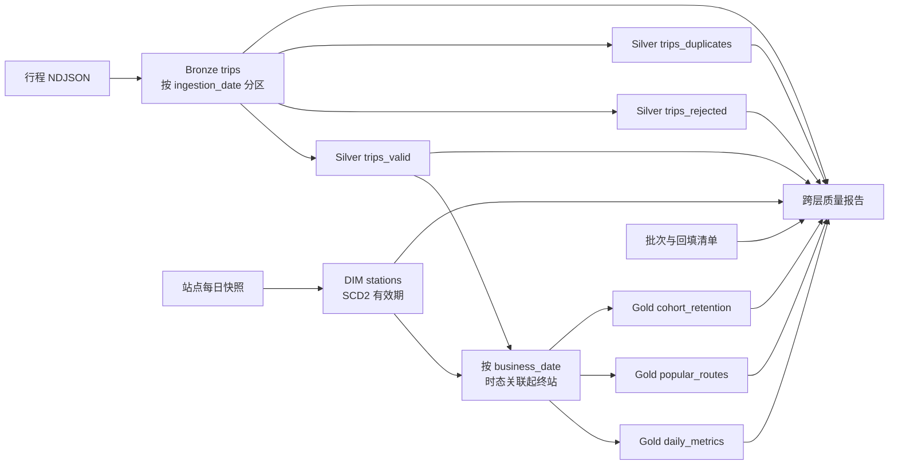

# 架构与数据模型

## 系统边界

这是单机可复现的批处理作品集，不是云端或生产集群。输入是仓库内固定 NDJSON，计算引擎是 PySpark `local[2]`，存储格式是本地 Parquet，控制信息和验收报告使用 JSON。Windows 负责启动脚本，涉及 Parquet 的作业在 WSL/Linux 中运行。

## 数据流

## 数据集粒度

| 数据集 | 一行代表什么 | 关键字段/分区 |
| --- | --- | --- |
| Bronze trips | 一次收到的原始行程记录 | `ingestion_date` 分区、来源文件 |
| Silver trips_valid | 一次通过规则且去重后的行程 | `trip_id`、`business_date` |
| Silver trips_rejected | 一次业务或结构失败记录 | 错误码、来源 SHA-256 |
| Silver trips_duplicates | 一条精确重复或主键冲突记录 | `trip_id`、`duplicate_kind` |
| DIM stations | 一个站点的一个历史属性版本 | `[valid_from, valid_to)`、`is_current` |
| Gold daily_metrics | 日期×起点行政区×骑行者类型×车辆类型 | `business_date` 分区 |
| Gold popular_routes | 日期×起点行政区内的一条 Top 路线 | `route_rank`，默认 Top 3 |
| Gold cohort_retention | 一个 cohort 在一个活动日的留存结果 | `cohort_date` 分区 |

## 关键正确性约束

- Bronze 同日期采用动态分区覆盖，重跑不追加重复数据，也不删除其他日期。
- Silver 满足 `Bronze = valid + rejected + duplicates` 行数守恒。
- 同一 `trip_id` 的不同内容不选择任意赢家，而是全部进入冲突重复集。
- 每个站点恰好一个当前版本，相邻 SCD2 有效期连续且不重叠。
- Gold 时态关联使用 `business_date >= valid_from AND business_date < valid_to`；当前版本允许 `valid_to IS NULL`。
- 任一起终站点没有有效维度版本时 Gold 直接失败，不静默丢行。
- Gold 日指标的行程数总和必须等于合法 Silver 行程数。
- Cohort 第 0 天留存人数等于 cohort 规模、留存率等于 1。

## 失败与恢复

Bronze 与回填先写 `RUNNING` 控制记录，成功转为 `SUCCEEDED`，异常转为 `FAILED`。JSON 通过同目录临时文件加原子替换提交，防止半写文件。回填先验证业务日期和全局合法 `trip_id` 分区隔离，再替换目标 Bronze/Silver 分区与目标日期的 Gold 日指标、路线分区；cohort 依赖所有骑行者的首次活动日，因此全量重算。相同输入、日期和 SHA-256 生成相同批次身份，重跑增加尝试次数。当前各层文件写入不具备跨作业事务提交能力。

## 可验证入口

- `scripts/run-portfolio-demo.ps1`：隔离目录内重建全部层、执行质量门禁和测试；
- `scripts/test-all.ps1`：运行 21 项自动化测试；
- `scripts/run-benchmark.ps1`：1 轮预热加 3 轮本机性能测量；
- `evidence/benchmark-10000-local.json`：保存环境、输入指纹和逐轮原始结果。
